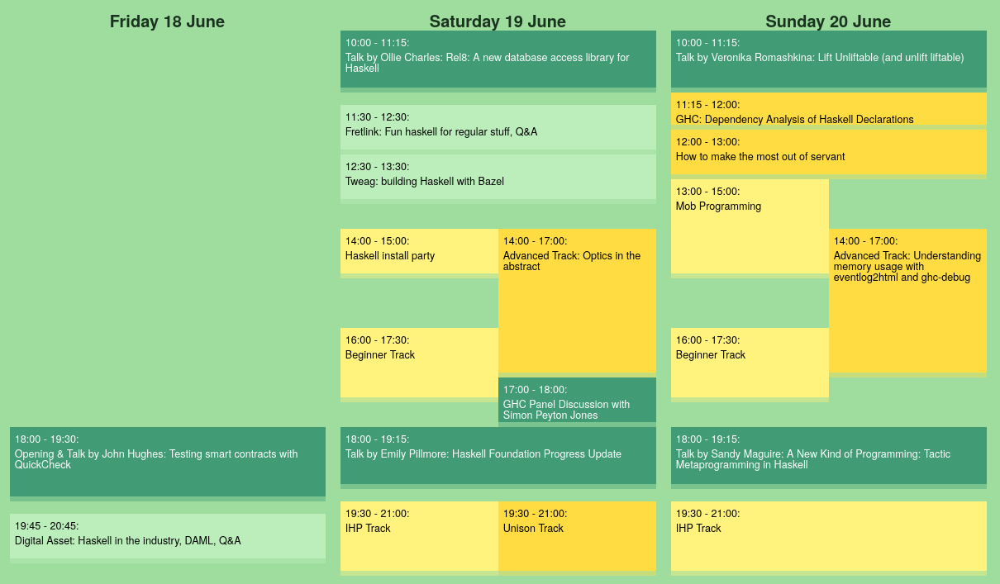

# This is the ZuriHac calendar

## Goals

* Smart about timezones, could work for remote events as well as in-person.
* Easy to completely style with lightweight CSS.
* Figures out parallel running events automatically and respects their order.
* Optional: source of truth is readable and correct with NoScript.

## Building

    nix-shell --command 'spago bundle-app'

## Deploying

Copy `index.js` wherever.

## Example

A table in the `.schedule` class gets turned into a nicer looking schedule.
Look at <index.html> for the expected markup.

## Demo

<https://zfoh.ch/zurihac2021/#schedule>
